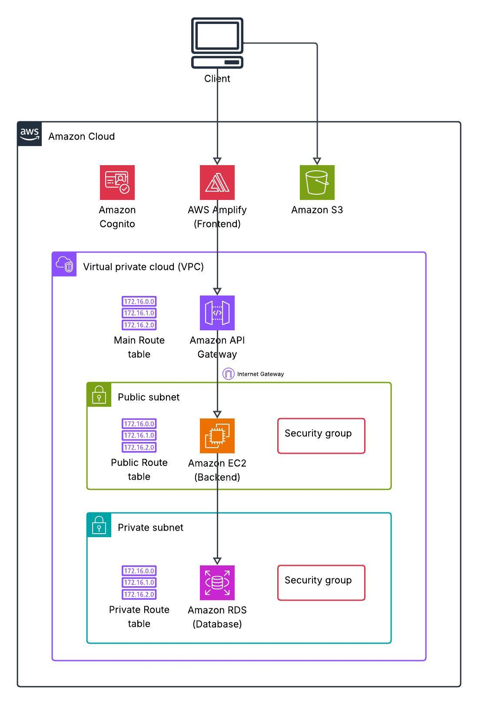
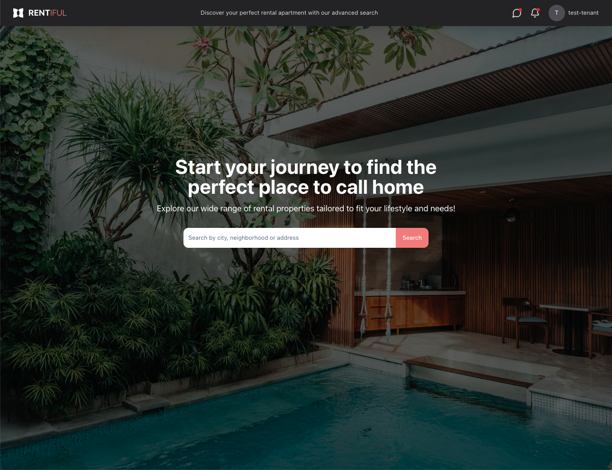
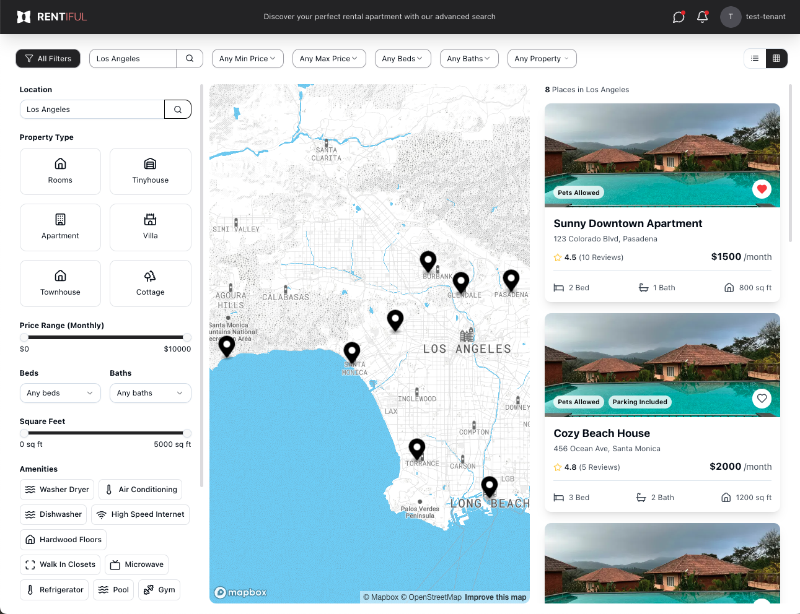
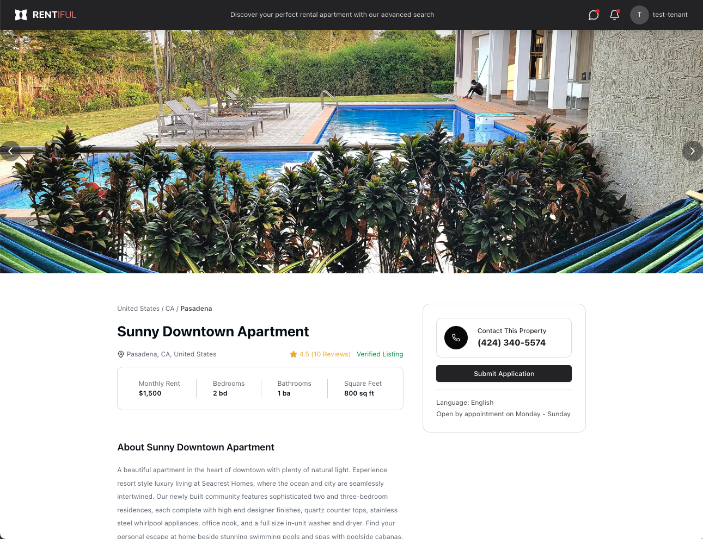
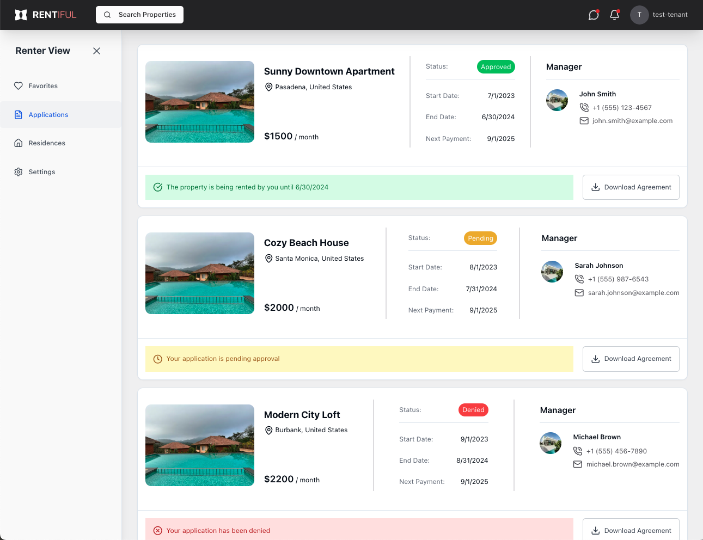
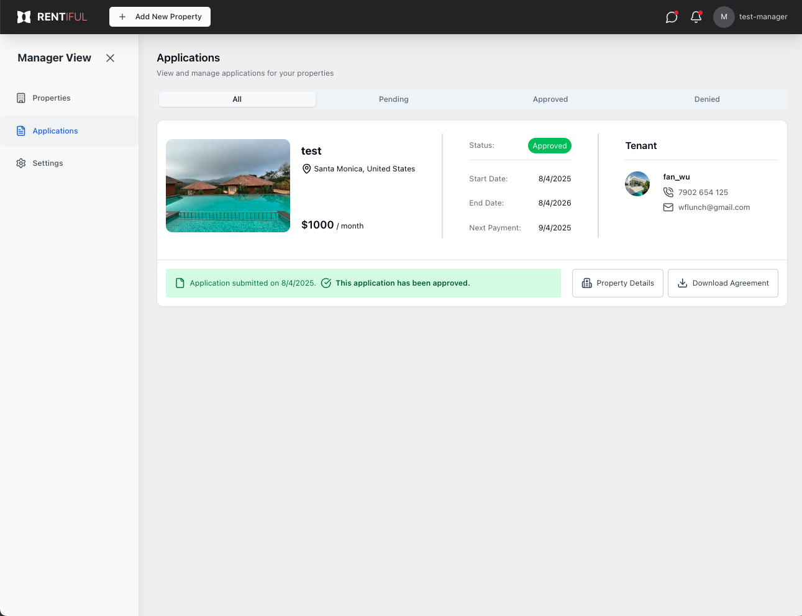

# [Rental App](https://main.d20fthmjv9pfc3.amplifyapp.com/)

## Overview

A full-stack rental application for property listings, search, and tenant/manager management, built with Next.js, Node.js, Express, and AWS. Designed for real-world scalability, geolocation-based search, and modern cloud deployment.

## Demo

**Test Tenant Login**

Email: wflunch+test1@gmail.com

Password: Password123!

**Test Manager Login**

Email: wflunch+test2@gmail.com

Password: Password123!

## Improvements

- Enhanced AWS S3 Integration – Configured S3 by attaching an IAM role to the EC2 instance and enabling binary media types in API Gateway for seamless file uploads
- Optimized Client-Side Rendering – Used dynamic imports for the tenant/manager settings form to resolve the File is not defined error in AWS Amplify
- Modularized Form Handling – Created a dedicated new property form component and dynamically imported it to prevent File is not defined errors in AWS Amplify
- Stronger Type Safety – Added explicit type casting for amenities and available date fields in the full filters component to prevent server-side errors

## Features

Anyone can visit home page and search properties with filters (price, bedrooms, bathrooms, area, amenities, available date, location). View detailed property pages with photo gallery and interactive map.

Template properties are located in **Los Angeles**.

After sign up and sign in, a user can either visit the website as a tenant or manager.

### Tenant Features

- Add a property as favorite and remove favorites
- Submit an application for a property
- Manage current and past residences
- Modify user name, email and phone number

### Manager Features

- Add new property listings with rich details and multiple photos
- View applicantion details from the dashboard and decide to approve or reject the application
- Modify user name, email and phone number

## Project Architecture

This project is structured with **separate frontend and backend deployments** for optimal scalability.

### **Frontend**

- Built with **Next.js + TypeScript**
- Styled with **Tailwind CSS** and **Shadcn UI**
- Form handling with `react-hook-form`
- State management via **Redux Toolkit + RTK Query**

### **Backend**

- **Node.js + Express** REST API
- **Prisma ORM** for database access
- **PostgreSQL + PostGIS** for geospatial queries
- Advanced filtering with SQL array and geospatial operators
- File uploads with AWS S3 integration
- Environment-driven configuration for security

### **DevOps & Cloud**

- AWS Amplify for frontend hosting and GitHub-based CI/CD
- AWS EC2 for backend hosting with PM2 process manager
- AWS RDS PostgreSQL for production database
- AWS S3 for media storage and retrieval

<table>
    <tr>
        <td align="center">
            <br/>
            AWS Structure
        </td>
    </tr>
</table>

## Tech Stack

| Category         | Technologies                                        |
| ---------------- | --------------------------------------------------- |
| **Frontend**     | Next.js, React, TypeScript, Tailwind CSS, Shadcn UI |
| **Backend**      | Node.js, Express, Prisma, PostgreSQL, PostGIS       |
| **Cloud/DevOps** | AWS Amplify, AWS EC2, AWS S3, PM2, AWS Cognito      |
| **Other Tools**  | Git, Multer, Axios                                  |

## Getting started

### 1. Clone and install

```
git clone https://github.com/yamchips/rental-app-prod
cd rental-app-prod/server
npm install
cd ../client
npm install
```

### 2. Configure environment variables

Environment variables in frontend:

- NEXT_PUBLIC_API_BASE_URL
- NEXT_PUBLIC_AWS_COGNITO_USER_POOL_ID
- NEXT_PUBLIC_AWS_COGNITO_USER_POOL_CLIENT_ID
- NEXT_PUBLIC_MAPBOX_ACCESS_TOKEN

Environment variables in backend:

- PORT
- DATABASE_URL
- S3_BUCKET_NAME
- AWS_REGION

### 3. Start frontend and backend

Run `npm run dev` in client and server folder.

## Screenshots

<table>
    <tr>
        <td align="center">
            <br/>
            Landing Page
        </td>
    </tr>
    <tr>
        <td align="center">
            <br/>
            Property Search Page with filters
        </td>
    </tr>
    <tr>
        <td align="center">
            <br/>
            Property detail page
        </td>
    </tr>
    <tr>
        <td align="center">
            <br/>
            Tenant Applications
        </td>
    </tr>
    <tr>
        <td align="center" colspan="2">
            <br/>
            Manager Applications
        </td>
    </tr>
</table>

## Future Improvements

### Technical

- Improve property's picture format in the single property page
- Improve loading and error skeleton
- Guarantee only one prisma client is created

### Feature Enhancements

- Mobile app (React Native) version
- Analytics dashboard for managers
- Payment integration (Stripe) for rent collection
